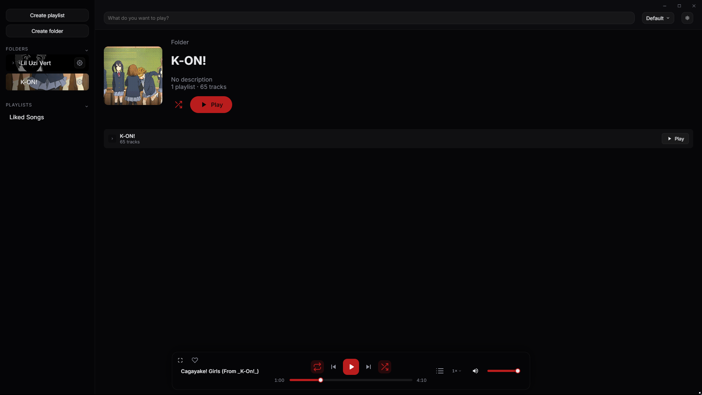
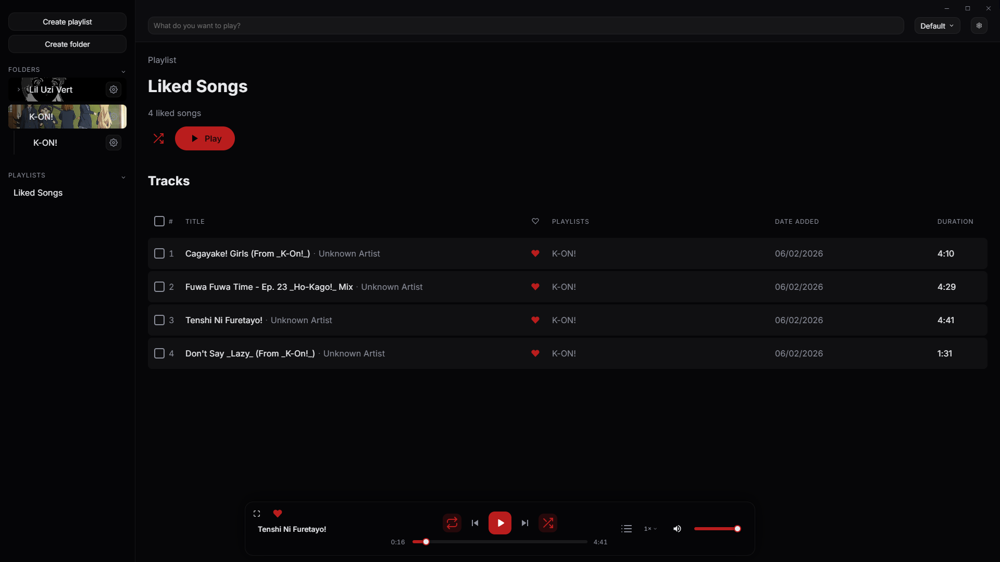
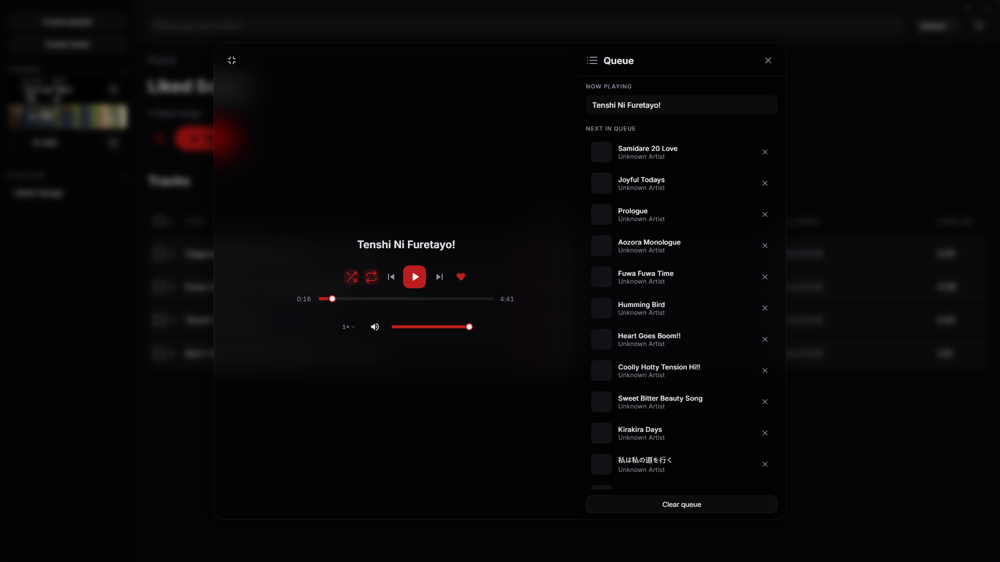
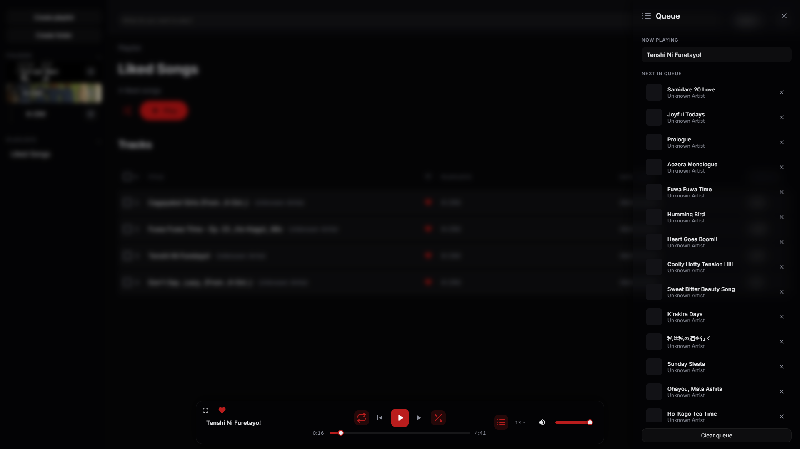
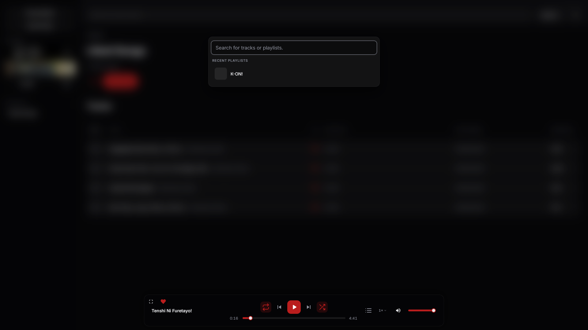
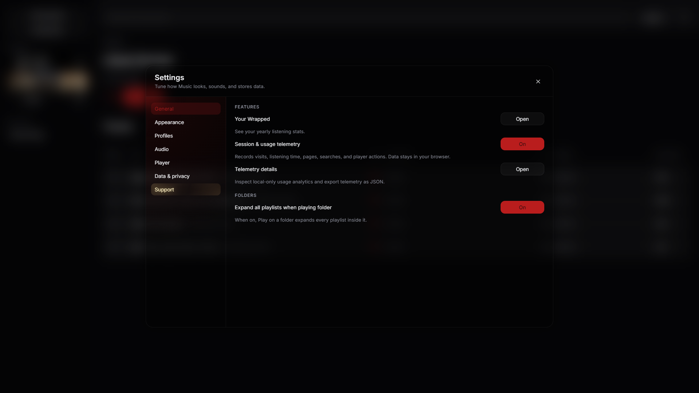
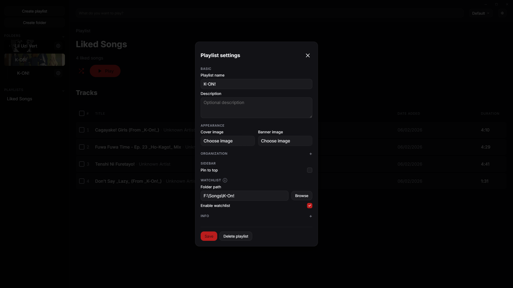
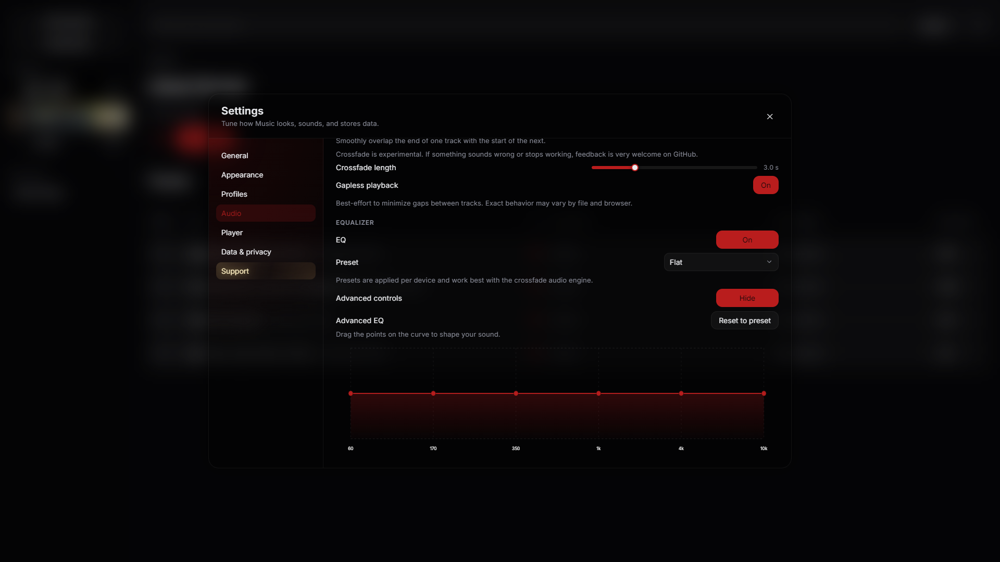
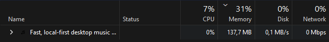

# Music – Electron Edition

A slick, local‑first desktop music player focused on **fast startup, low memory usage and a clean Windows‑native feel**.

Current desktop app version: **1.4.0** (see `CHANGELOG.md`).

---

## Highlights

- **Local library first**: Point the app at your music folders and build a library that stays on your machine.
- **Playlists & folders**: Organise your music with playlists, folders and pinned items in the sidebar.
- **Watchlist playlists**: Attach a playlist to a folder – new files dropped into that folder are automatically imported.
- **Per‑profile likes**: Liked Songs is profile‑aware so different users can have their own favourites.
- **Advanced audio controls**: Fullscreen player, queue, speed controls and an advanced EQ editor.
- **Low memory footprint**: Tuned specifically to use much less RAM than big streaming clients.

---

## UI preview

| Playlist view | Liked Songs | Fullscreen player |
| --- | --- | --- |
|  |  |  |

| Queue | Search |
| --- | --- |
|  |  |

| Settings | Playlist settings |
| --- | --- |
|  |  |

| Advanced EQ |
| --- |
|  |

---

## Memory & performance

This Electron build is tuned to stay lightweight compared to typical streaming clients.

| Music – Electron Edition | Spotify desktop client |
| --- | --- |
|  |  |

Numbers will vary by library size and other apps running, but the goal is to stay noticeably lean while your library scales.

---

## Installing the desktop app (Windows)

You don’t need Node or npm to use the app – only if you want to develop it.

1. Locate the installer in `dist/` (for example: `Music Setup 1.4.0.exe`).  
2. Double‑click it and follow the installer steps.  
3. Launch **Music** from the Start menu or desktop shortcut.

That’s it – you now have a native‑feeling desktop player with your local library.

---

<details>
<summary><strong>Developer setup & build</strong></summary>

### Project layout

- `electron/` – Electron main and preload processes.
- `web/` – React/Vite renderer (UI & audio engine).
- `dist-electron/` – Compiled Electron TypeScript output.
- `web/dist/` – Built web assets for production.
- `build/icons/` – App icons for the window, taskbar and installer.

### Running the dev build

```bash
# From the repo root
npm install
cd web && npm install
cd ..
npm run dev
```

This starts the Vite dev server on `http://localhost:5173` and launches Electron pointing at it. Hot reload works for both the renderer and Electron process.

### Building a production installer

1. Make sure icons exist:
   - `build/icons/app.png` – used by the Electron window.
   - `build/icons/app.ico` – multi‑size ICO used by the installer / EXE.
2. From the repo root, run:

   ```bash
   npm run build
   ```

   This will:

   - Build the web app into `web/dist` with a `file://`‑friendly base path.
   - Compile the Electron code into `dist-electron`.
   - Run `electron-builder` to create a Windows installer in `dist/`.

3. Share the generated `dist/Music Setup x.y.z.exe` file.

</details>

---

## Fix list (this fork)

- **Watchlist folder picker**: Playlist watchlist “Browse” now consistently uses the native Windows folder picker and supports a default path so it opens near the current watch folder.
- **Likes in packaged builds**: Liking tracks (including right‑click “Save to Liked Songs”) now works correctly in the built Electron app, not just in dev.
- **Playlist right‑click actions**: Added “Remove from playlist” to the track context menu when viewing a playlist.

---

## Future features / optimisations

- **Custom in‑app folder browser**: Optional skinnable folder picker that matches the app’s theme while keeping the current watchlist logic.
- **Watchlist quality‑of‑life tweaks**: Remember last‑used watchlist roots, quick access to common library locations, and clearer messaging for inaccessible folders.
- **Further performance tuning**: More optimisations for huge libraries and watchlist rescans (batched updates, smarter diffing and better progress feedback).
