## Music

A fast, offline‑first, fully open source music player that runs entirely in your browser.  
Import local files, organize them into playlists and folders, and enjoy a clean, keyboard‑friendly UI with rich theming.

[](https://github.com/Jahbas/Music/stargazers)
[](https://github.com/Jahbas/Music/issues)
[](https://github.com/Jahbas/Music/commits/main)

---

### Table of contents

- **Overview**
  - [Preview](#preview)
  - [Highlights](#highlights)
- **Usage**
  - [Getting started](#getting-started)
  - [Keyboard & power features](#keyboard--power-features)
  - [Telemetry & privacy](#telemetry--privacy)
- **Project**
  - [Tech stack](#tech-stack)
  - [Changelog](#changelog)
  - [Contributing](#contributing)

---

### Preview

| Main view | Queue panel | Fullscreen player |
|-----------|-------------|-------------------|
| 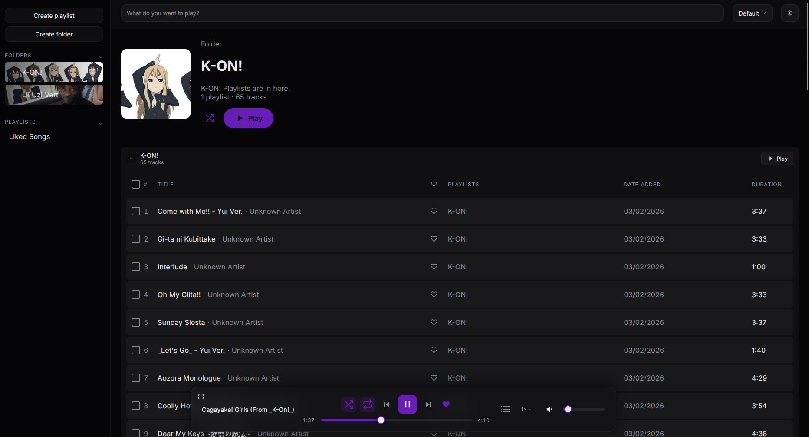 | 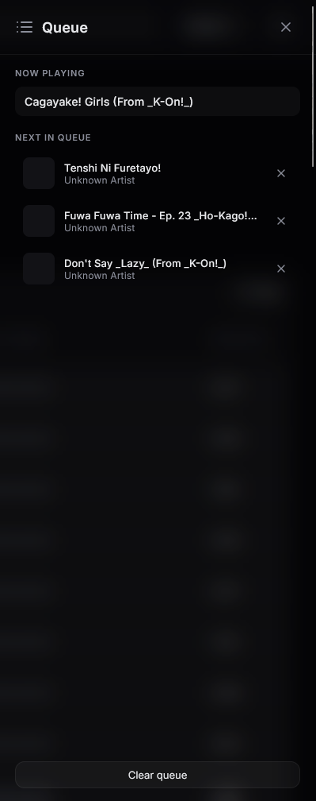 | 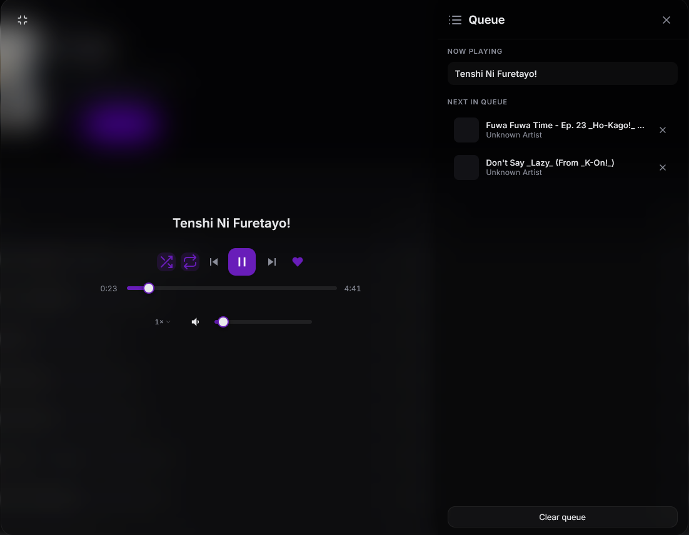 |

| Wrapped (play history) | Session & usage telemetry | Search |
|------------------------|---------------------------|--------|
| 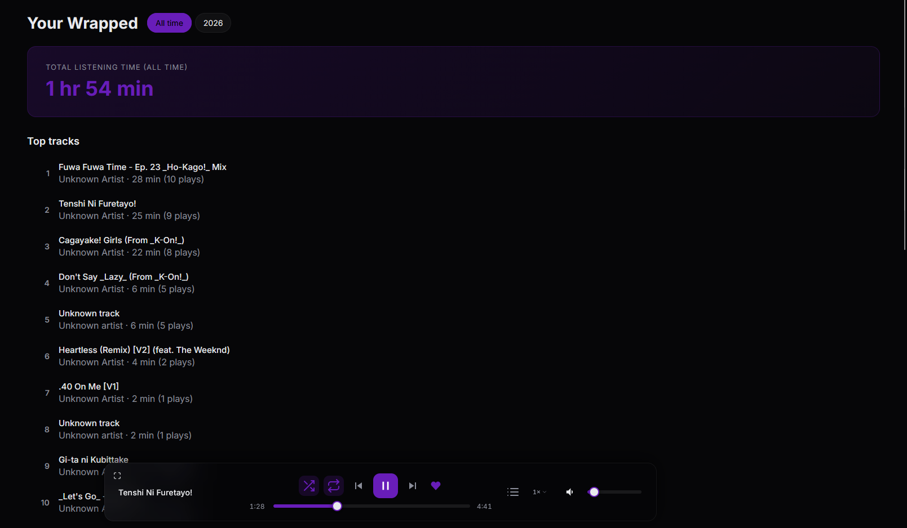 | 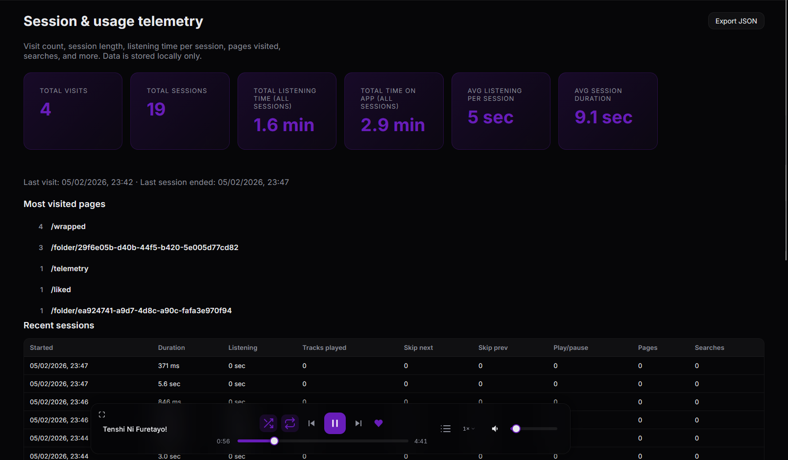 | 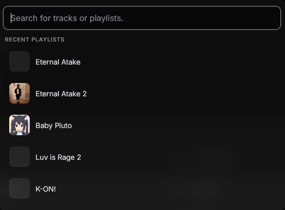 |

<details>
<summary><strong>Light mode</strong></summary>

| Main view | Queue panel | Fullscreen player |
|-----------|-------------|-------------------|
| 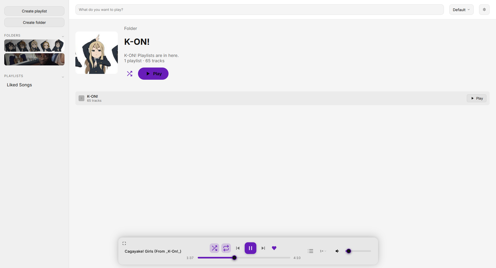 | 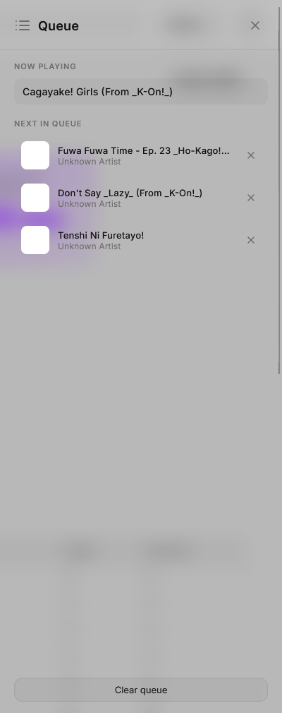 | 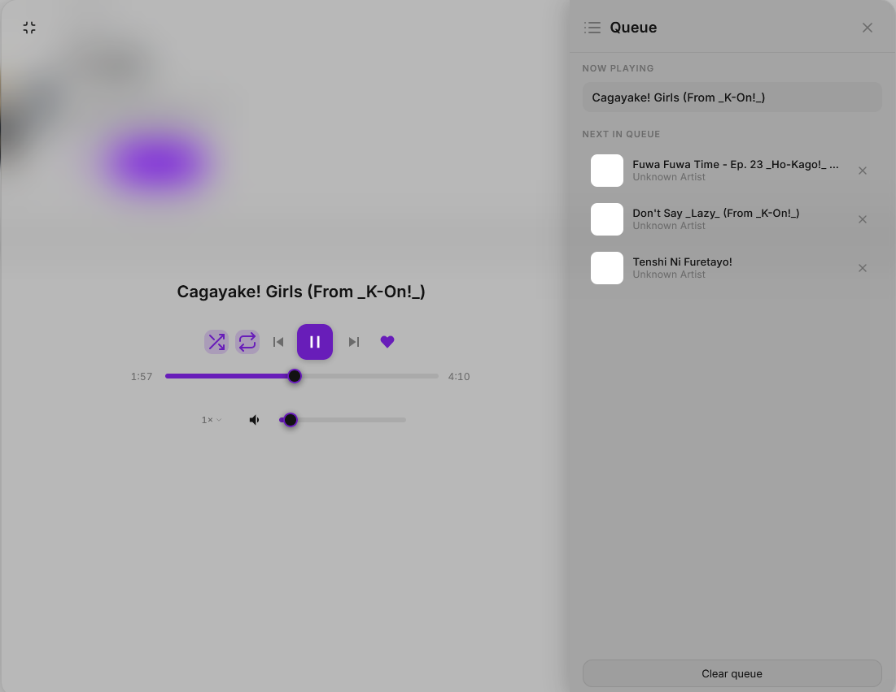 |

| Wrapped (play history) | Session & usage telemetry |
|------------------------|---------------------------|
| 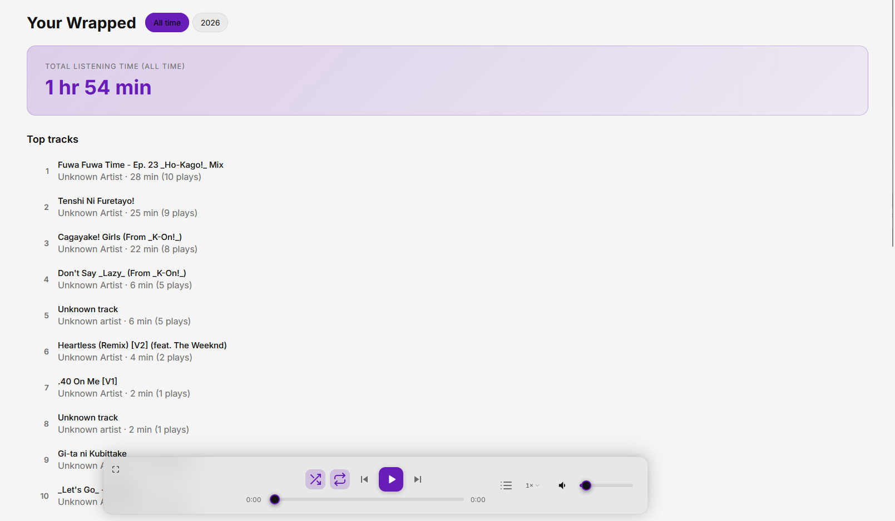 | 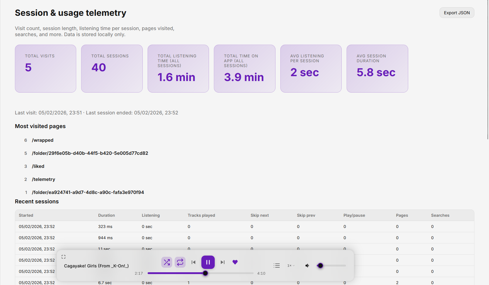 |

</details>

<details>
<summary><strong>OLED theme</strong></summary>

| Main view | Queue panel | Fullscreen player |
|-----------|-------------|-------------------|
| 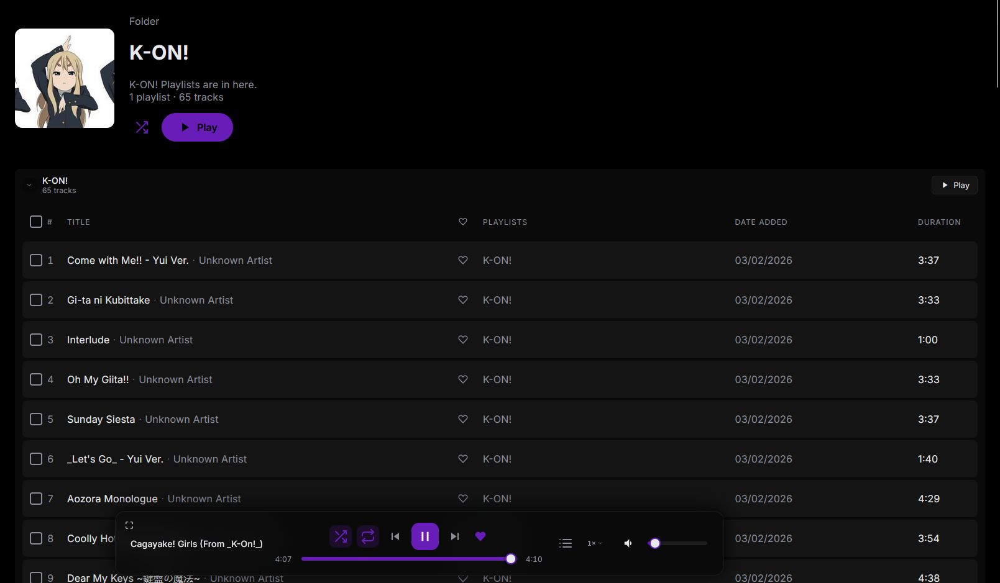 | 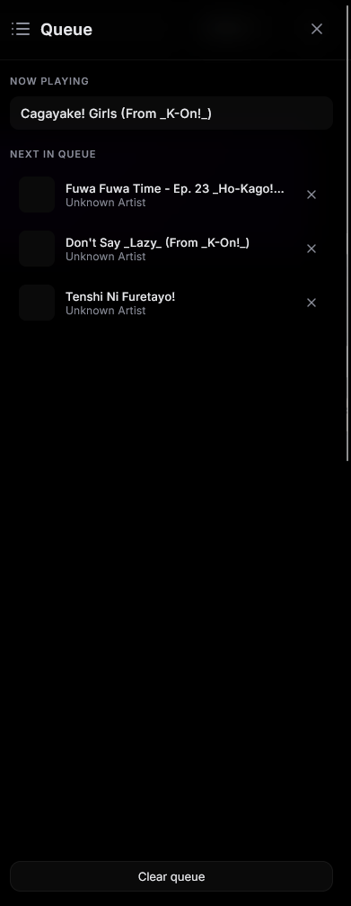 | 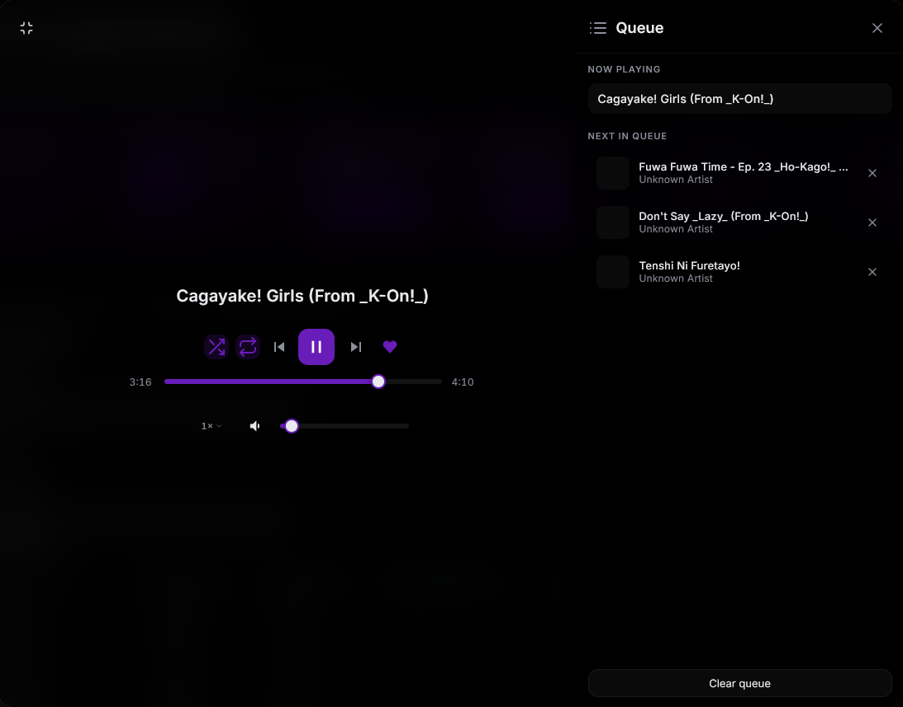 |

| Wrapped (play history) | Session & usage telemetry |
|------------------------|---------------------------|
| 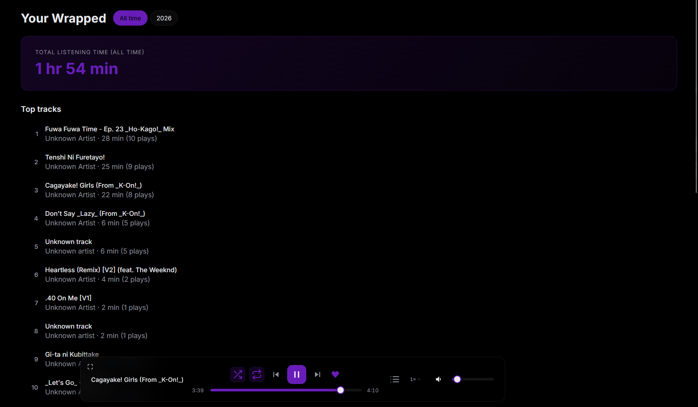 | 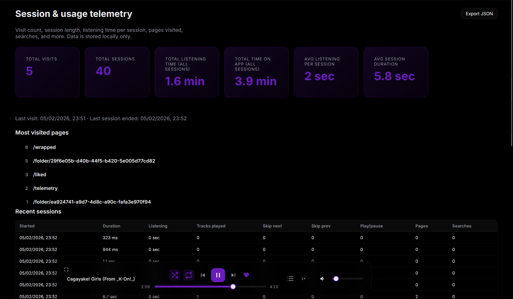 |

</details>

---

### Highlights

- **Local-first library**: All tracks, playlists, folders, and artwork are stored in IndexedDB in your browser.
- **Queue panel**: Open the queue from the player bar to see “Now playing” and “Next in queue.” Reorder upcoming tracks by drag-and-drop, remove items, or clear the queue. Drag tracks from any view into the queue to add them.
- **Repeat and shuffle**: Repeat cycles through off, repeat queue (infinite play), and repeat track. Shuffle with one tap. Active states are shown in the player bar.
- **Multiple profiles**: Create and switch between profiles in the top bar. Folders are scoped per profile so you can separate work, personal, or different libraries. “New profile” and “Delete all data” live in Settings.
- **Playlist folders**: Group playlists into folders with names, icons, and banners. Play or shuffle an entire folder. Drag playlists in the sidebar to assign them to folders.
- **Folder view**: Browse each folder with all tracks from its playlists; play or shuffle the folder. Optional setting in Settings to expand all playlists when you hit Play on a folder.
- **Liked Songs**: Smart view that lists all liked tracks from library, playlists, and search—with play, shuffle, and drag-and-drop support.
- **Drag and drop everywhere**: Drag tracks onto a playlist in the sidebar to add them, or drag multiple tracks to open the “Add to playlist” overlay and drop on a playlist. Drop files or a folder on the sidebar to add tracks to the library; dropping a folder creates a new playlist with that folder’s name and navigates to it.
- **Playback speed**: Apple-style speed menu (0.5×–1.5×) next to the volume control; rate is persisted and applied in real time.
- **Wrapped**: Play-history stats view—most played tracks and artists, total time, by year—with play and queue actions.
- **Session & usage telemetry**: Local-only analytics (Settings → “Session & usage telemetry” or `/telemetry`). Tracks visits, sessions, listening time per session, pages visited, search queries, track plays, skips, and play/pause toggles. View aggregates (total listening time, most visited pages, recent searches) and a table of recent sessions. Export a JSON snapshot to clipboard. All data stays in your browser; nothing is sent elsewhere.
- **Search**: Full-text search across your library; results are playable and support add-to-playlist and queue.
- **Beautiful themes**: Modern, glassy UI with light, dark, and OLED-friendly themes for long listening sessions.
- **No account, no tracking**: Everything stays on your machine.

---

### Getting started

#### 1. Install dependencies

```bash
npm install
```

#### 2. Run the dev server

```bash
npm run dev
```

Open the printed local URL in your browser.

#### 3. Build for production

```bash
npm run build
```

To preview the built app locally:

```bash
npm run preview
```

---

### Keyboard & power features

- **Global shortcuts**: Core playback actions (play/pause, next/previous, like, volume) and navigation are wired up to keyboard shortcuts for quick control.
- **Drag-to-queue and drag-to-playlist**: You can drag one or many tracks into the queue panel or onto sidebar playlists and folders without touching any context menus.
- **Profile-aware folders**: When you switch profiles, the sidebar and folder views update to show only that profile’s folders and content.

---

### Telemetry & privacy

- **Local-only analytics**: Session and usage telemetry is stored in your browser (localStorage) and never sent to any server.
- **Rich session view**: The Telemetry view (`/telemetry`) shows visits, sessions, listening time, pages visited, search queries, and player actions with per-session breakdowns and aggregates.
- **Exportable data**: You can export a JSON snapshot of your telemetry to the clipboard from within the Telemetry view.

---

### Tech stack

- **Frontend**: React 18, React Router, TypeScript
- **State management**: Zustand
- **Tooling**: Vite 5
- **Storage & metadata**: IndexedDB via `idb`, `music-metadata-browser` for audio metadata

---

### Changelog

The project uses a human-readable changelog that tracks every notable change.

- **1.4.0 – Crossfade, gapless, and EQ**: Added a dual-lane audio engine with configurable crossfade, a gapless playback toggle, a six-band EQ with presets and an advanced curve editor, plus theme/audio/player profiles and JSON settings backup.
- **1.3.0 – Queue panel and telemetry**: Added a dedicated queue panel with drag-and-drop support and a local-only session & usage telemetry system with a rich `/telemetry` view.
- **1.2.0 – Repeat and profiles**: Introduced repeat queue/track modes, multiple profiles, and a setting for expanding playlists when playing a folder.
- **1.1.0 – Folders and Liked Songs**: Added playlist folders, a folder view, a global Liked Songs view, and improved playback speed and sidebar organization.

See the full **changelog and latest updates** in [`CHANGELOG.md`](./CHANGELOG.md).

---

### Contributing

Bug reports, feature ideas, and pull requests are very welcome.  
If you have a feature request or found a bug, open an issue on the GitHub repository and it will be looked into.

